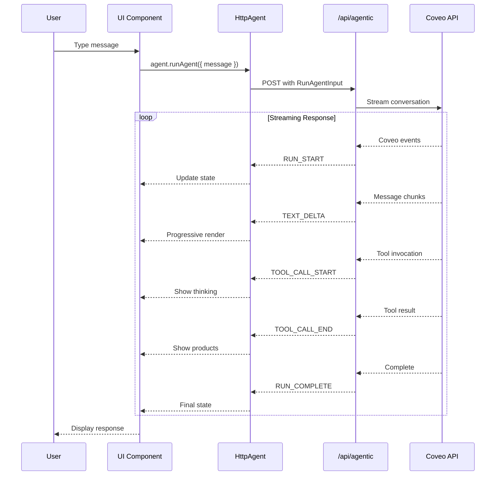

# AG-UI Migration Plan - Barca Sports Hydrogen

## Executive Summary

This document outlines the migration strategy from the current custom streaming implementation to AG-UI protocol standards. The migration is designed to be incremental, testable, and reversible at each step.

---

## Implementation Decisions

✅ **Finalized Strategy:**

1. **Server Changes**: Only modify YOUR API route (`api.agentic.conversation.ts`), NOT Coveo's API
   - Coveo API remains completely unchanged
   - Your route acts as adapter/transformer middleware
   - Transforms Coveo events → AG-UI standard events

2. **State Management**: Hybrid approach (Option C)
   - Keep IndexedDB for persistence (localStorage)
   - Sync with AG-UI agent state for active conversations
   - Best of both worlds: durable storage + reactive state

3. **Testing**: Flexible, test-as-you-go approach
   - Manual testing at each milestone
   - No rigid test suite requirements upfront

4. **Thinking Display**: Standard events + custom metadata (Option C)
   - Use AG-UI's `TOOL_CALL_START` → `TOOL_CALL_ARGS` → `TOOL_CALL_END` sequence
   - Enhance with custom metadata for rich UI display
   - Maintains AG-UI compliance while preserving current UX

5. **Product Search**: TBD during implementation
   - Analyze actual Coveo event structure first
   - Choose between tool pattern, special events, or hybrid
   - Decision deferred to Phase 1 discovery

6. **Starting Point**: Phase 1 - Foundation first
   - Install dependencies
   - Create type system
   - Build transformation layer
   - Low-risk, high-value foundation

---

## Current Architecture

```mermaid
graph TB
    subgraph "Frontend (React)"
        UI[UI Components<br/>16 Generative Components]
        Hooks[Custom Hooks Layer<br/>useAssistantStreaming<br/>useConversationState<br/>useSendMessage]
        SSE[SSE Parser<br/>Custom Event Types]
    end
    
    subgraph "Backend (React Router)"
        API[/api/agentic/conversation]
        Transform[Event Transformer<br/>Coveo → Custom Format]
    end
    
    subgraph "External"
        Coveo[Coveo Agentic API<br/>platformdev.cloud.coveo.com]
    end
    
    UI --> Hooks
    Hooks --> SSE
    SSE --> API
    API --> Transform
    Transform --> Coveo
    
    style UI fill:#e1f5ff
    style Hooks fill:#fff4e1
    style SSE fill:#ffe1e1
    style API fill:#e1ffe1
```

### Current Event Flow
```
User Input → sendMessage() → POST /api/agentic/conversation
                                    ↓
                        Coveo Agentic API (streaming)
                                    ↓
                    Custom Events (SSE): turn_started, status, 
                                        tool_invocation, message, 
                                        tool_result, turn_complete
                                    ↓
                        parseAssistantStreamEvent()
                                    ↓
                        processSSEStream() with buffer
                                    ↓
                    State updates via setConversations
                                    ↓
                            UI re-renders
```

---

## Target Architecture with AG-UI

```mermaid
graph TB
    subgraph "Frontend (React)"
        UI[UI Components<br/>Same 16 Components]
        Context[GenerativeProvider<br/>AG-UI Agent Integration]
        Agent[HttpAgent<br/>@ag-ui/client]
        Adapter[Event Adapter<br/>Custom → AG-UI Events]
    end
    
    subgraph "Backend (React Router)"
        API[/api/agentic/conversation<br/>AG-UI Compatible]
        Transform[Event Transformer<br/>Coveo → AG-UI BaseEvents]
    end
    
    subgraph "External"
        Coveo[Coveo Agentic API]
    end
    
    UI --> Context
    Context --> Agent
    Agent -->|Observable<BaseEvent>| Adapter
    Adapter --> API
    API --> Transform
    Transform --> Coveo
    
    style UI fill:#e1f5ff
    style Context fill:#d4edda
    style Agent fill:#d4edda
    style Adapter fill:#fff3cd
    style API fill:#e1ffe1
```

### Target Event Flow
```
User Input → agent.runAgent() → Observable subscription
                                        ↓
                        POST /api/agentic/conversation
                                        ↓
                            Coveo Agentic API
                                        ↓
                    AG-UI BaseEvents: RUN_START, TEXT_DELTA,
                                     TOOL_CALL_START, TOOL_CALL_END,
                                     RUN_COMPLETE
                                        ↓
                        Observable stream processing
                                        ↓
                    Agent state management (built-in)
                                        ↓
                            UI re-renders
```

---

## Event Mapping Strategy

### Phase 1: Event Protocol Alignment

| Current Event Type | AG-UI Event Type | Payload Mapping | Notes |
|-------------------|------------------|-----------------|-------|
| `turn_started` | `RUN_START` | `sessionId` → `runId` | Start of agent execution |
| `status` | `TEXT_DELTA` | Custom metadata for status | Display as thinking/progress |
| `status_update` | `TEXT_DELTA` | Custom metadata | Progressive status updates |
| `tool_invocation` | `TOOL_CALL_START` | Extract tool name from message | Beginning of tool execution |
| `tool_result` | `TOOL_CALL_END` | `products[]` → tool result | Tool execution complete |
| `message` | `TEXT_DELTA` | Direct content mapping | Streaming assistant response |
| `turn_complete` | `RUN_COMPLETE` | `sessionId` → `runId` | End of agent execution |
| `error` | `ERROR` | `message` → `error` | Error handling |

### Event Structure Comparison

**Current Custom Event:**
```typescript
{
  type: 'tool_result',
  payload: {
    sessionId: 'conv_123',
    message: 'Found 3 products',
    products: [...]
  }
}
```

**AG-UI BaseEvent:**
```typescript
{
  type: 'TOOL_CALL_END',
  toolCallId: 'tool_456',
  toolName: 'search_products',
  result: {
    message: 'Found 3 products',
    products: [...]
  },
  timestamp: '2026-01-13T...'
}
```

---

## Migration Phases

### Phase 1: Foundation & Event Types ✅ (Day 1)

**Goal:** Establish AG-UI event types without breaking existing functionality

**Tasks:**
1. Install dependencies
   ```bash
   npm install @ag-ui/client rxjs
   npm install -D @types/node
   ```

2. Create AG-UI event type definitions
   - [ ] `app/lib/generative/ag-ui/events.ts` - AG-UI event types
   - [ ] `app/lib/generative/ag-ui/types.ts` - Type definitions
   - [ ] `app/lib/generative/ag-ui/constants.ts` - Event constants

3. Create bidirectional event transformers
   - [ ] `app/lib/generative/ag-ui/transformers/to-agui.ts` - Custom → AG-UI
   - [ ] `app/lib/generative/ag-ui/transformers/from-agui.ts` - AG-UI → Custom
   - [ ] Unit tests for transformers

**Deliverable:** Type-safe event transformation layer (backward compatible)

**Discovery Task:**
- [ ] Analyze actual Coveo event structure for product search
- [ ] Determine if product search is tool-based or embedded in responses
- [ ] Make decision on product search pattern (tool vs special event)

**Testing:**
- Run existing UI - should work unchanged
- Transform events both directions - verify data integrity
- Document Coveo event patterns discovered

---

### Phase 2: Server-Side AG-UI Events ✅ (Day 1-2)

**Goal:** Make YOUR API endpoint emit AG-UI standard events

**Important:** You're only modifying YOUR route (`api.agentic.conversation.ts`), NOT Coveo's API!
- Coveo API stays completely unchanged
- Your route acts as middleware/adapter
- Transforms Coveo events to AG-UI format before streaming to client

**Tasks:**
1. Update YOUR API route to support AG-UI events
   - [ ] Add feature flag: `USE_AGUI_EVENTS`
   - [ ] Modify `api.agentic.conversation.ts` to transform and emit AG-UI events
   - [ ] Keep backward compatibility (dual format support)

2. Create AG-UI event builder utilities
   - [ ] `app/lib/generative/ag-ui/builders.ts` - Event construction helpers

3. Update streaming logic
   - [ ] Modify `handleStreamConversation` to use AG-UI format
   - [ ] Add proper `runId`, `messageId`, `toolCallId` generation
   - [ ] Maintain session correlation

**Deliverable:** Server emits AG-UI compliant events (toggleable)

**Testing:**
- Toggle flag OFF: existing flow works
- Toggle flag ON: AG-UI events stream correctly
- Verify event sequence: RUN_START → TEXT_DELTA → RUN_COMPLETE

---

### Phase 3: AG-UI HttpAgent Integration ✅ (Day 2-3)

**Goal:** Replace custom streaming with AG-UI HttpAgent

**Tasks:**
1. Create custom HttpAgent wrapper
   - [ ] `app/lib/generative/ag-ui/agent.ts` - Custom agent class
   - [ ] Handle locale, cart context, tracking ID
   - [ ] Implement proper error handling

2. Create agent hook
   - [ ] `app/lib/generative/ag-ui/use-agui-agent.ts`
   - [ ] Manage agent lifecycle
   - [ ] Observable subscription management
   - [ ] Integrate with existing state management

3. Update `useAssistantStreaming` hook
   - [ ] Add AG-UI mode toggle
   - [ ] Create adapter that bridges AG-UI events to existing state updates
   - [ ] Maintain backward compatibility

**Deliverable:** Working HttpAgent that can replace custom streaming

**Testing:**
- Send message → verify Observable receives events
- Check message history syncs correctly
- Verify streaming still works (progressive text rendering)
- Test abort/cancel functionality

---

### Phase 4: Component Migration (Day 3-4)

**Goal:** Migrate UI components one by one to use AG-UI agent

**Migration Order:**
1. **MessageBubble** (lowest risk - just renders data) ✅
2. **MessageListContainer** (container, minimal logic) ✅
3. **ConversationTranscript** (orchestrates messages) ✅
4. **ThinkingStatusPanel** (tool call visualization) ✅
5. **ProductResultsMessage** (tool results) ✅
6. **ChatInputFooter** (user input) ✅
7. **AssistantHeader** (controls) ✅
8. **ConversationSidebar** (history management) ✅

**For each component:**
- [ ] Create AG-UI variant with `-agui.tsx` suffix
- [ ] Update to use agent state/methods
- [ ] Side-by-side testing with original
- [ ] Switch via feature flag
- [ ] Remove old version after validation

**Deliverable:** All components using AG-UI agent

**Testing Strategy:**
```typescript
// Feature flag approach
const USE_AGUI = process.env.VITE_USE_AGUI === 'true';

export default function GenerativeShoppingAssistant() {
  if (USE_AGUI) {
    return <GenerativeShoppingAssistantAGUI />;
  }
  return <GenerativeShoppingAssistantOriginal />;
}
```

---

### Phase 5: State Management Migration ✅ (Day 4-5)

**Goal:** Replace custom state hooks with AG-UI built-in state

**Tasks:**
1. Migrate conversation state
   - [ ] Replace `useConversationState` with agent's message history
   - [ ] Use agent.messages instead of custom messages array
   - [ ] Leverage `MESSAGES_SNAPSHOT` events

2. Migrate thinking state
   - [ ] Map thinking updates to AG-UI tool call events
   - [ ] Use `TOOL_CALL_START` → `TOOL_CALL_ARGS` → `TOOL_CALL_END` sequence
   - [ ] Update `ThinkingStatusPanel` to read from AG-UI events

3. Simplify hooks
   - [ ] Remove `useMessageDerivation` (AG-UI handles this)
   - [ ] Simplify `useSendMessage` (agent.runAgent() handles this)
   - [ ] Update `useConversationUrlSync` to use agent state

**Deliverable:** Simplified state management using AG-UI primitives

**Testing:**
- Verify conversation history persists correctly
- Check URL sync still works
- Test localStorage persistence
- Verify thinking status displays correctly

---

### Phase 6: Advanced Features ✅ (Day 5-6)

**Goal:** Leverage AG-UI's advanced capabilities

**Tasks:**
1. Implement proper tool support
   - [ ] Define tools for product search, cart operations
   - [ ] Add human-in-the-loop confirmations
   - [ ] Implement tool execution handlers

2. Add state delta support
   - [ ] Use `STATE_DELTA` for cart updates
   - [ ] Track user preferences in agent state
   - [ ] Implement state snapshots for persistence

3. Enhanced error handling
   - [ ] Implement automatic retry with exponential backoff
   - [ ] Better error recovery strategies
   - [ ] User-friendly error messages

4. Performance optimizations
   - [ ] Implement proper Observable cleanup
   - [ ] Add request debouncing
   - [ ] Optimize re-renders

**Deliverable:** Production-ready AG-UI integration

**Testing:**
- Load test with multiple concurrent conversations
- Test error scenarios (network failures, timeouts)
- Verify tool execution works correctly
- Check state persistence across page reloads

---

### Phase 7: Cleanup & Documentation ✅ (Day 6)

**Goal:** Remove legacy code, finalize documentation

**Tasks:**
1. Remove deprecated code
   - [ ] Delete old streaming hooks
   - [ ] Remove custom SSE parser
   - [ ] Clean up unused types

2. Update documentation
   - [ ] Update README with AG-UI integration details
   - [ ] Document event flow
   - [ ] Add architecture diagrams

3. Performance audit
   - [ ] Bundle size analysis
   - [ ] Runtime performance profiling
   - [ ] Memory leak checks

**Deliverable:** Clean, documented, production-ready codebase

---

## File Structure Changes

### New Files to Create

```
app/lib/generative/ag-ui/
├── index.ts                    # Public exports
├── agent.ts                    # Custom HttpAgent wrapper
├── types.ts                    # AG-UI type definitions
├── events.ts                   # Event type definitions
├── constants.ts                # Event type constants
├── builders.ts                 # Event builder utilities
├── use-agui-agent.ts          # React hook for agent
├── transformers/
│   ├── to-agui.ts             # Custom → AG-UI
│   └── from-agui.ts           # AG-UI → Custom
└── utils/
    ├── message-mapper.ts      # Message conversion
    └── state-sync.ts          # State synchronization
```

### Files to Modify

```
app/routes/api.agentic.conversation.ts   # Emit AG-UI events
app/routes/($locale).generative.tsx      # Use AG-UI agent
app/lib/generative/context.tsx           # Add AG-UI support
app/lib/generative/use-assistant-streaming.ts  # AG-UI mode
```

### Files to Eventually Remove (Phase 7)

```
app/lib/generative/streaming/buffer.ts
app/lib/generative/streaming/sse-parser.ts
app/lib/generative/use-assistant-streaming.ts (old version)
```

---

## Integration Architecture Diagram



---

## Testing Strategy

### Unit Tests
- [ ] Event transformers (to-agui, from-agui)
- [ ] Event builders
- [ ] Message mappers
- [ ] State sync utilities

### Integration Tests
- [ ] Full message flow (user input → response)
- [ ] Tool invocation sequence
- [ ] Error handling
- [ ] State persistence

### E2E Tests
- [ ] Complete conversation flow
- [ ] Multiple conversations
- [ ] Browser refresh (state restoration)
- [ ] Network interruption recovery

### Manual Testing Checklist
- [ ] Send basic text message
- [ ] Send message triggering product search
- [ ] Test thinking status display
- [ ] Test product cards rendering
- [ ] Test conversation switching
- [ ] Test new conversation creation
- [ ] Test conversation deletion
- [ ] Test URL sync with conversation ID
- [ ] Test error states
- [ ] Test abort/cancel mid-stream
- [ ] Test retry on failure
- [ ] Test browser refresh
- [ ] Test multiple browser tabs

---

## Rollback Strategy

At each phase, we maintain the ability to rollback:

### Phase 1-2: Feature Flag
```typescript
const USE_AGUI_EVENTS = process.env.VITE_USE_AGUI_EVENTS === 'true';
```

### Phase 3-4: Dual Implementation
```typescript
const USE_AGUI_AGENT = process.env.VITE_USE_AGUI_AGENT === 'true';

if (USE_AGUI_AGENT) {
  return <GenerativeShoppingAssistantAGUI />;
}
return <GenerativeShoppingAssistantOriginal />;
```

### Phase 5-7: Git Branch
- Keep original implementation in separate branch
- Can cherry-pick fixes to production
- Full rollback via branch switch

---

## Success Criteria

- [ ] All 16 UI components working with AG-UI
- [ ] Message streaming works identically to original
- [ ] Thinking status displays correctly
- [ ] Product search and display works
- [ ] Conversation management (create, switch, delete) works
- [ ] URL sync and persistence work
- [ ] Error handling is robust
- [ ] Performance is equal or better than original
- [ ] Bundle size increase < 50KB
- [ ] No console errors or warnings
- [ ] All TypeScript types are correct
- [ ] Documentation is updated

---

## Dependencies

### New Dependencies
```json
{
  "@ag-ui/client": "^1.x.x",
  "rxjs": "^7.x.x"
}
```

### Dev Dependencies
```json
{
  "@types/node": "^20.x.x"
}
```

---

## Risk Assessment

| Risk | Impact | Probability | Mitigation |
|------|--------|-------------|------------|
| Breaking streaming | High | Medium | Feature flags, parallel implementation |
| State sync issues | High | Medium | Comprehensive testing, gradual migration |
| Performance degradation | Medium | Low | Profiling, benchmarking |
| Bundle size increase | Low | High | Tree shaking, lazy loading |
| Learning curve | Medium | Low | Documentation, examples |

---

## Timeline Estimate

| Phase | Duration | Dependencies |
|-------|----------|--------------|
| Phase 1: Foundation | 4 hours | None |
| Phase 2: Server Events | 4 hours | Phase 1 |
| Phase 3: Agent Integration | 6 hours | Phase 2 |
| Phase 4: Component Migration | 8 hours | Phase 3 |
| Phase 5: State Management | 6 hours | Phase 4 |
| Phase 6: Advanced Features | 6 hours | Phase 5 |
| Phase 7: Cleanup | 2 hours | Phase 6 |
| **Total** | **~36 hours** | **~1 week** |

For demo purposes (single branch, parallel work): **1-2 days intensive work**

---

## Next Steps

1. Review this plan and approve
2. Answer clarifying questions
3. Create feature branch: `feature/ag-ui-integration`
4. Start Phase 1: Install dependencies and create foundation
5. Implement phases sequentially with testing at each step
6. Demo at each milestone for feedback

---

## Questions for Product Owner

✅ **Answered:**
1. Server changes scope: Only YOUR route, not Coveo API ✅
2. State management: IndexedDB + AG-UI hybrid ✅
3. Testing approach: Flexible, test-as-you-go ✅
4. Thinking display: Standard TOOL_CALL events + custom metadata ✅
5. Product search pattern: TBD during Phase 1 discovery ✅
6. Starting point: Phase 1 - Foundation first ✅

❓ **Open Questions:**
1. Should we maintain backward compatibility indefinitely or plan to remove old code?
2. Are there specific user flows that are highest priority to test?
3. Should we implement analytics for comparing old vs new implementation?
4. Any performance benchmarks we should target?
5. Timeline for going to production?

---

## Resources

- [AG-UI Documentation](https://docs.ag-ui.com)
- [AG-UI GitHub](https://github.com/ag-ui/ag-ui)
- [RxJS Documentation](https://rxjs.dev)
- Current implementation in `app/lib/generative/`
